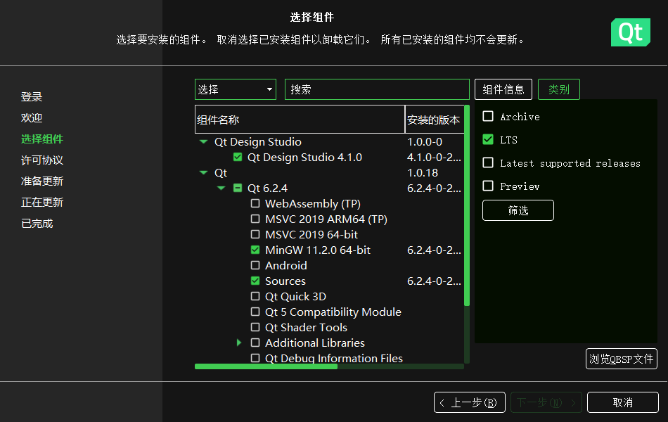
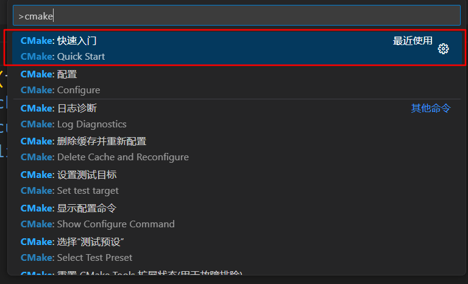

# windows配置vckpg + cmake + vscode + mingw + qt

## 1. 下载和配置环境

直接官网下载，并把path配置好。用qt的话可以偷懒，qt中包含mingw和cmake套件

### qt

一般选tls长期维护的版本



然后无脑下一步。

### git

到[Git - Downloads (git-scm.com)](https://git-scm.com/downloads)下载windows版的Git，安装选好编辑器无脑下一步即可

### vcpkg

用下面的命令安装vcpkg

```shell
git clone https://github.com/microsoft/vcpkg
.\vcpkg\bootstrap-vcpkg.bat
```

把vcpkg这个目录添加到path这个环境变量，还需要添加下面的环境变量用来指定编译器和vcpkg.cmake位置

````
VCPKG_DEFAULT_HOST_TRIPLET=x64-mingw-dynamic
VCPKG_DEFAULT_TRIPLET=x64-mingw-dynamic
CMAKE_TOOLCHAIN_FILE<path to>vcpkg\scripts\buildsystems\vcpkg.cmake
````

## 应用的配置

### vscode

1. 下载c/c++，CMake，CMake Tools插件，选择编译器为mingw
2. 添加头文件位置<path to>vcpkg\installed\x64-mingw-dynamic\include\\*\*

### vcpkg

```shell
vcpkg install <packages name>
```

以安装curl做演示

1. ```shell
   vcpkg install curl
   ```

2. 安装成功后会显示

   ```
   curl provides CMake targets:
   
   	# this is heuristically generated, and may not be correct
   	 find_package(CURL CONFIG REQUIRED)
   	 target_link_libraries(main PRIVATE CURL::libcurl)
   ```

### cmake

写好cmake后先命令**快速入门**



CMakelists.txt添加下列指令

```cmake
find_package(CURL CONFIG REQUIRED)
target_link_libraries(main PRIVATE CURL::libcurl)
```

ps:find_package要在add_executable前面

若构建的时候报错

```shell
CMake Error at D:/vcpkg/scripts/buildsystems/vcpkg.cmake:852 (_find_package):Could not find a package configuration file provided by "CURL" with any of
the following names:

  CURLConfig.cmake
  curl-config.cmake

Add the installation prefix of "CURL" to CMAKE_PREFIX_PATH or set
"CURL_DIR" to a directory containing one of the above files.  If "CURL"
provides a separate development package or SDK, be sure it has been
installed.
```

则需要在find_package前添加

```cmake
set(CULR_DIR "<path to>/vcpkg/packages/curl_x64-mingw-dynamic/share/curl")
```


## 附加

vcpkg一些环境变量

```
VCPKG_DOWNLOADS	可以将此环境变量设置为用于存储下载内容的现有目录，而不是内部 downloads/ 目录。 它应始终设置为绝对路径。
VCPKG_DEFAULT_BINARY_CACHE	此环境变量重定向默认位置以存储二进制包。
```

